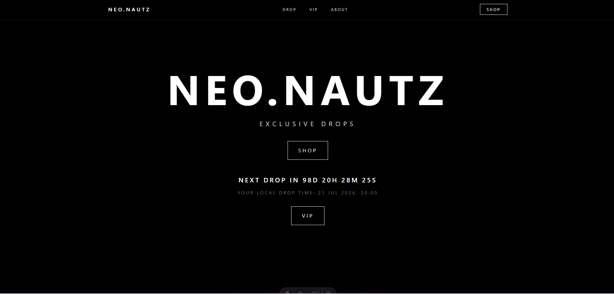
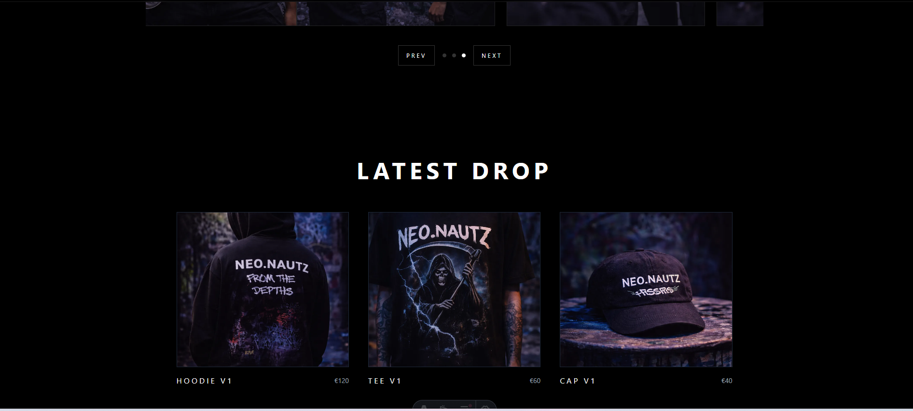
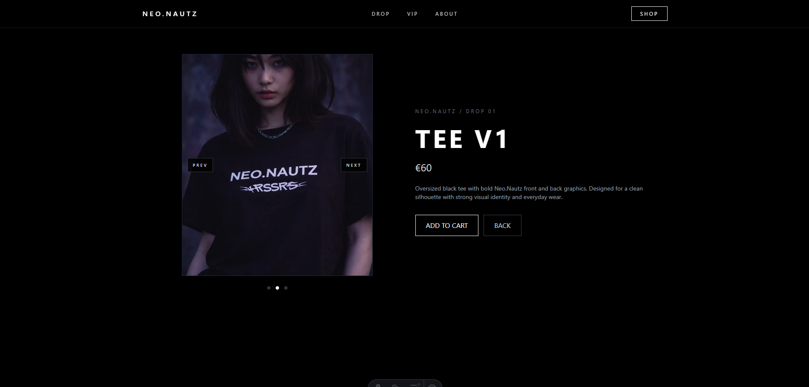
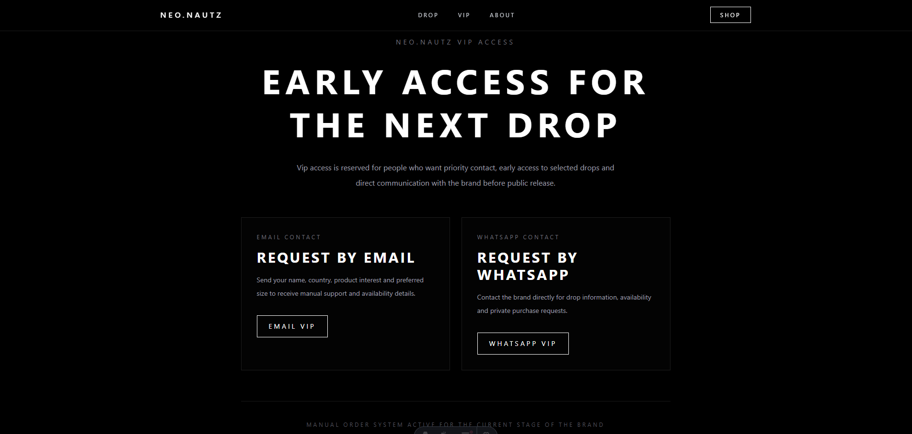

# 🚀 Neo.Nautz – E-commerce Landing

Modern streetwear landing page built with **Astro** and **Tailwind CSS**, focused on clean UI, performance and drop-based product experience.

---

## 🌐 Live Demo

👉 https://drops-brand-astro.vercel.app

---

## ✨ Features

* Responsive design (mobile & desktop)
* Clean and modern UI
* Component-based architecture
* Optimized performance
* Product drop countdown system
* Sold-out logic for limited items

---

## 🛠 Tech Stack

* Astro
* Tailwind CSS
* JavaScript

---

## 📸 Preview

### 🏠 Home

<p align="center">
  
</p>

### 🛍️ Products

<p align="center">
  
</p>

### 📦 Product Detail

<p align="center">
  
</p>

### 🔐 VIP Section

<p align="center">
  
</p>

---

## 📦 Installation

```bash
npm install
npm run dev
```

---

## 📌 Notes

This project represents a **modern drop-based e-commerce concept**, inspired by current streetwear brands and focused on user experience and performance.

---

## 👨‍💻 Author

Ignacio Ortiz
Full Stack Developer


